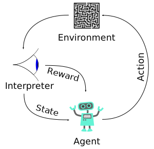

# Deep Reinforcement Learning Introduction
Without lengthy math formulas, we'll try to give a short and not-so-rigorous
introduction for readers new to reinforcement learning. Experienced
RL(reinforcement learning) users should skip to the design. For the detailed
formula-rich review of the algorithms here I strongly recommend Lilian Weng's
[policy gradient
blog](https://lilianweng.github.io/lil-log/2018/04/08/policy-gradient-algorithms.html).

## Problem Formulation
This Wikipedia figure captures the reinforcement learning setup.

There is an **agent** that interacts with a **environment**. The agent perceives
the environment's Markovian **states** and gives **actions** back to it. Each
time an agent makes an action, the environment state will likely change, and the
agent might receive a **reward** associated with the action. The agent makes a
number of steps collecting the state, makes an action and receive a reward. The
sequence of these steps is a **trajectory**. The span of the trajectory is a
**horizon**.

The basic objective of the learning is to maximize the rewards collected along
the entire horizon. For episodic problems trajectories will reach a terminal
state and therefore they are finite. For infinite horizons usually future
rewards are discounted by a factor close to 1, so that the total rewards will be
summed up to a finite number.

Our case study, a variant of bin packing, involves an agent looking at states,
comprising a number of bins and the next item to pack. Its action is the
choosing of a bin for an item. This problem, is a finite-horizon problem,
because the bin capacities are limited, and the bins will eventually be full.
When the bins are full, the packing episode will be over, and we aim to optimize
the total number of items that can be held in the bins given.

## Algorithms Implemented

Popular deep RL algorithms are roughly in 2 camps: policy gradient and Q
learning. A policy defines how an agent reacts to environment states. Policy
gradient methods always have a model that takes in the state and spits out an
action probability distribution. Through trial-and-error, these methods use
gradient-ascend like methods to improve the policy over time so that better and
better policies will be produced.

Q-learning fits a function that estimates the optimal values of state-action
pairs. The value of a state-action pair means the expected future rewards given
a state and an action (or reaction) taken. This function is called Q-function. A
Q-learning agent takes this value model and uses it to recommend the best
actions without directly using a policy model.

In this project we have implemented 3 policy gradient methods so far. Q-learning
methods are under investigation, because so far they are not producing better
results than PPO in our case study.

### REINFOCE
REINFOCE is the vanilla policy gradient algorithm. In its simplest form, it has
only one network. Its objective is the future rewards times the log probability
of the action taken given a state. I.e.

Here  is
the network parameter. _R_ is the total future reward. And
 is the
policy (action probability distribution given a state).  Through
trial-and-error, we'll regress onto this objective and improve our policy.

Using gradient ascend on this objective means that we'll make good actions more
likely over time, and bad actions less likely. Take chess for example, the
future reward will be either 1(win) or -1(lose) at the end of a game.
Through trials, in the future we'll make all moves in the won games more likely,
and all moves in the lost games less likely. For non-binary results, the more
rewards, the more likely the actions will be taken in the future.

In actual implementations rarely raw rewards are used, because there is too much
variance. Advantages are used instead. Advantage means the difference between
the future reward through the action taken, and the state value (expected rewards
given a state). This is equivalent to the original objective because the state
value isn't dependent on the network parameters, and the gradient will be
exactly the same.

### Actor Critic
REINFOCE can be applied to a wide range of problems, because it doesn't really
assume Markovian states. However, training REINFOCE is slow, because in our
trials we need to wait for the episodes to be over to be able to make one step
of gradient ascend.  Actor critic introduces one more network (critic network)
that estimates state values, so that we won't have to wait for a terminal state
to be able to estimate advantages.

Our actor critic implementation incorporates [GAE (general advantage
estimation)](https://danieltakeshi.github.io/2017/04/02/notes-on-the-generalized-advantage-estimation-paper/).
This concept is hard to explain. We'll skip it here.

